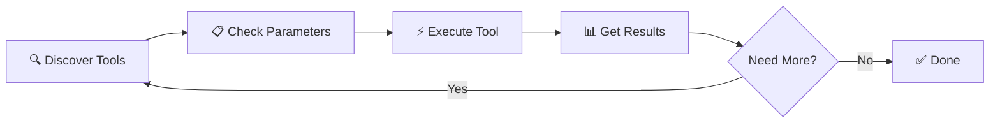

<div align="center">

# 🚀 MCP360 Universal Gateway


[](https://opensource.org/licenses/MIT)
[](https://nodejs.org)

[Get Started](#-quick-start) • [Features](#-key-features) • [Documentation](https://help.mcp360.ai/) • [Support](https://mcp360.ai)

</div>

---

## 🎯 What is MCP360?

**MCP360 is a unified MCP gateway** that gives AI agents access to **100+ external tools and sources**. You can connect your agents once and immediately run searches, research tasks, SEO workflows, and other operational actions. Instead of spending days integrating multiple APIs, connect to **100+ tools** easily with a simple setup.

---


## ✨ Key Features

<table align="center"> 
  <tr> 
    <td align="center" width="30%"> 
       
      <br/> 
      <strong>Smart Discovery</strong> 
      <br/> 
      <sub>Find the perfect tool across all connected MCP servers</sub> 
    </td> 
    <td align="center" width="30%"> 
       
      <br/> 
      <strong>Universal Execution</strong> 
      <br/> 
      <sub>Run any tool from any MCP server with a single command</sub> 
    </td> 
    <td align="center" width="30%"> 
       
      <br/> 
      <strong>Enterprise Security</strong> 
      <br/> 
      <sub>API key authentication with secure token handling</sub> 
    </td> 
  </tr> 
  <tr> 
    <td align="center" width="30%"> 
       
      <br/> 
      <strong>Universal Access</strong> 
      <br/> 
      <sub>Single gateway to marketplace MCPs and custom integrations</sub> 
    </td> 
    <td align="center" width="30%"> 
       
      <br/> 
      <strong>Lightning Fast</strong> 
      <br/> 
      <sub>Optimized for performance with global CDN delivery</sub> 
    </td> 
    <td align="center" width="30%"> 
       
      <br/> 
      <strong>Universal Compatibility</strong> 
      <br/> 
      <sub>Works with Claude Desktop, Cursor, Windsurf, VS Code & more</sub> 
    </td> 
  </tr> 
</table>

---

## 🚀 Quick Start

### Step 1: Get Your API Key

1. **Sign up** at [mcp360.ai](https://mcp360.ai) 🎉
2. Navigate to **Settings → API Keys** ⚙️
3. Click **Generate New Key** 🔑
4. Copy your API key securely 📋

### Step 2: Choose Your Platform

<details open>
<summary><b>🖥️ Claude Desktop</b> (Click to expand)</summary>

<br>

**Configuration File Locations:**
- **macOS:** `~/Library/Application Support/Claude/claude_desktop_config.json`
- **Windows:** `%APPDATA%\Claude\claude_desktop_config.json`

**Add this configuration:**

```json
{
  "mcpServers": {
    "mcp360": {
      "command": "npx",
      "args": ["-y", "@mcp360/universal-gateway"],
      "env": {
        "MCP360_API_KEY": "your_api_key_here"
      }
    }
  }
}
```

**Restart Claude Desktop** and you're ready! 🎊

</details>

<details>
<summary><b>🎯 Cursor</b></summary>

<br>

1. Open Cursor Settings: `Cmd/Ctrl + Shift + J`
2. Navigate to the **MCP** section
3. Add server configuration:

```json
{
  "mcpServers": {
    "mcp360": {
      "command": "npx",
      "args": ["-y", "@mcp360/universal-gateway"],
      "env": {
        "MCP360_API_KEY": "your_api_key_here"
      }
    }
  }
}
```

**Restart Cursor** to activate! 🚀

</details>

<details>
<summary><b>💻 Claude Code</b></summary>

<br>

**Configuration File Locations:**
- **macOS/Linux:** `~/.config/claude-code/mcp_settings.json`
- **Windows:** `%APPDATA%\claude-code\mcp_settings.json`

**Add this configuration:**

```json
{
  "mcpServers": {
    "mcp360": {
      "command": "npx",
      "args": ["-y", "@mcp360/universal-gateway"],
      "env": {
        "MCP360_API_KEY": "your_api_key_here"
      }
    }
  }
}
```

**Restart Claude Code** to load the gateway! ✨

</details>

<details>
<summary><b>🌊 Windsurf</b></summary>

<br>

**Configuration File Locations:**
- **macOS:** `~/Library/Application Support/Windsurf/mcp_config.json`
- **Windows:** `%APPDATA%\Windsurf\mcp_config.json`

**Add this configuration:**

```json
{
  "mcpServers": {
    "mcp360": {
      "command": "npx",
      "args": ["-y", "@mcp360/universal-gateway"],
      "env": {
        "MCP360_API_KEY": "your_api_key_here"
      }
    }
  }
}
```

**Restart Windsurf** to activate! 🌟

</details>

<details>
<summary><b>🔧 VS Code (Cline Extension)</b></summary>

<br>

1. Install the [Cline extension](https://marketplace.visualstudio.com/items?itemName=saoudrizwan.claude-dev)
2. Open **Cline settings**
3. Add MCP server configuration:

```json
{
  "mcpServers": {
    "mcp360": {
      "command": "npx",
      "args": ["-y", "@mcp360/universal-gateway"],
      "env": {
        "MCP360_API_KEY": "your_api_key_here"
      }
    }
  }
}
```

**Reload VS Code** to activate the gateway! 💡

</details>

### 🚄 Pro Tip: Global Installation

For **faster startup times**, install globally:

```bash
npm install -g @mcp360/universal-gateway
```

Then update your config to use the global command:

```json
{
  "mcpServers": {
    "mcp360": {
      "command": "mcp360-gateway",
      "env": {
        "MCP360_API_KEY": "your_api_key_here"
      }
    }
  }
}
```

---

## 🛠️ Core Tools

The gateway provides **2 powerful meta-tools** that unlock access to 100+ services:

### 1️⃣ `search` - Discover Available Tools

Find the perfect tool for your task across all connected MCP servers.

**Parameters:**
- `query` *(optional)*: Search term to filter by name or description

**Examples:**

```bash
💬 "Search for email tools"
💬 "Show me all available tools"
💬 "Find tools for SEO"
💬 "What tools can help with keyword research?"
```

**Returns:** Comprehensive list of matching tools with names, descriptions, and parameters.

---

### 2️⃣ `execute` - Run Any Tool

Execute any tool from any connected MCP server with dynamic parameters.

**Parameters:**
- `tool_name` *(required)*: Name of the tool to execute
- `arguments` *(optional)*: Tool-specific parameters as an object

**Examples:**

```bash
💬 "Execute verify_email with email 'test@example.com'"
💬 "Run keyword_research with keyword 'AI tools'"
💬 "Execute get_crypto_price for Bitcoin"
```

**Returns:** Tool-specific results tailored to your request.

---

## 🌟 Available Services

<div align="center">

### 🏪 MCP360 Marketplace

</div>

| Service | Description | Use Cases |
|---------|-------------|-----------|
| 🔍 **Keyword Research** | SEO keyword analysis & search volumes | Content strategy, SEO optimization |
| 📊 **OnPage SEO Checker** | Website SEO element analysis | Site audits, optimization |
| ✉️ **Email Verification** | Validate email addresses | List cleaning, form validation |
| 🕷️ **Web Scraping** | Extract content from websites | Data collection, monitoring |
| 📈 **Google Trends** | Search trends & interest data | Market research, trending topics |
| 💰 **Cryptocurrency** | Real-time crypto prices & market data | Price tracking, portfolio management |

<div align="center">

### 🔧 Your Custom MCPs

</div>

All custom MCP servers you've created in your MCP360 account are automatically available through the Universal Gateway!

---

## 📖 Typical Workflow



### Example Session

```bash
# Step 1: Discover
User: "Search for email tools"
→ Returns: verify_email, send_email, email_lookup, etc.

# Step 2: Check Details
→ See: verify_email requires { email: string }

# Step 3: Execute
User: "Execute verify_email with email 'john@example.com'"
→ Returns: { valid: true, deliverable: true, ... }
```

---


**How it works:**

1. 🔐 **Authenticate** with your API key
2. 🔄 **Aggregate** all available tools from marketplace and custom MCPs
3. 🎯 **Expose** them through 2 simple meta-tools: `search` and `execute`
4. ⚡ **Execute** tools dynamically based on your requests

---

## 🔧 Configuration

### Environment Variables

| Variable |  Description | URL |
|----------|--------------|---------|
| `MCP360_TOOL_URL` |  Your MCP360 API key |  `https://connect.mcp360.ai/v1/mcp360/_tool_name_/mcp` |
| `MCP360_UNIVERSAL_GATEWAY` | Custom gateway URL | `https://connect.mcp360.ai/v1/mcp360/mcp` |

### Custom Gateway URL

For enterprise deployments or custom configurations:

```json
{
  "mcpServers": {
    "mcp360": {
      "command": "npx",
      "args": ["-y", "@mcp360/universal-gateway"],
      "env": {
        "MCP360_API_KEY": "your_api_key_here",
        "MCP360_GATEWAY_URL": "https://your-custom-gateway.com/mcp"
      }
    }
  }
}
```


---

## 🐛 Troubleshooting

<details>
<summary><b>❓ Gateway Not Appearing in Claude Desktop</b></summary>

<br>

**Solutions:**

1. ✅ Validate your `claude_desktop_config.json` is proper JSON
2. 🔑 Verify your API key is correct and not expired
3. 🔄 **Completely restart** Claude Desktop (quit and reopen)
4. 📋 Check Claude Desktop logs for detailed errors:
   - **macOS:** `~/Library/Logs/Claude/`
   - **Windows:** `%APPDATA%\Claude\logs\`

</details>

<details>
<summary><b>🔐 Authentication Errors</b></summary>

<br>

**Solutions:**

1. 🔍 Verify your API key is valid at [mcp360.ai](https://mcp360.ai/settings/api-keys)
2. ✅ Ensure you have correct permissions in your MCP360 account
3. ⚠️ Check that the API key hasn't been revoked or expired
4. 🔄 Try regenerating a new API key

</details>

<details>
<summary><b>⚡ Tool Execution Errors</b></summary>

<br>

**Solutions:**

1. 🔍 Use `search` first to verify the correct tool name
2. 📋 Ensure all **required parameters** are provided
3. 🎯 Verify parameter **types** match tool expectations
4. 📊 Review Claude Desktop logs for detailed error messages
5. 📖 Check tool documentation for specific requirements

</details>

<details>
<summary><b>🐌 Performance Issues</b></summary>

<br>

**Solutions:**

1. 🚄 Consider [global installation](#-pro-tip-global-installation) for faster startup
2. 🌐 Check your internet connection stability
3. 📊 Monitor MCP360 [status page](https://status.mcp360.ai)
4. 🔄 Clear npm cache: `npm cache clean --force`

</details>

---

## 📚 Resources
Learn how to set up, test, and manage MCP servers and functions using MCP360:
<div align="center">

 

</div>

<br>

<table align="center">
  <tr>
    <td align="center" width="50%">
      <a href="https://youtu.be/_ATqVSwubW4?si=KizJaFigHOcWgiag">
        
      </a>
      <br><br>
      <a href="https://youtu.be/_ATqVSwubW4?si=KizJaFigHOcWgiag">
        
      </a>
      <br><br>
      <sub><b>🚀 MCP360 Integration</b></sub>
      <br>
      <sub>Step-by-step installation, configuration, and your first tool execution. Perfect for beginners!</sub>
      <br>
    </td>
    <td align="center" width="50%">
      <a href="https://youtu.be/7y8lzoaI_04?si=kixfcGBro7VN4itl">
        
      </a>
      <br><br>
      <a href="https://youtu.be/7y8lzoaI_04?si=kixfcGBro7VN4itl">
        
      </a>
      <br><br>
      <sub><b>⚡ Advanced Capabilities</b></sub>
      <br>
      <sub>Deep dive into powerful features, custom MCPs, and advanced workflows for power users.</sub>
      <br>
    </td>
  </tr>
</table>

<br>

<div align="center">

### 📖 Additional Learning Resources

</div>

<table align="center">
  <tr>
    <td align="center" width="33%">
      <a href="https://help.mcp360.ai/">
        
      </a>
      <br><br>
      <a href="https://help.mcp360.ai/">
        
      </a>
      <br><br>
      <b>Help Center</b>
      <br>
      <sub>Comprehensive guides, API references, and best practices</sub>
    </td>
    <td align="center" width="33%">
      <a href="https://dev.to/ankur_saini_15d4f46b01601/i-built-a-smart-amazon-price-drop-alert-using-n8n-1l44">
        
      </a>
      <br><br>
      <a href="https://dev.to/ankur_saini_15d4f46b01601/i-built-a-smart-amazon-price-drop-alert-using-n8n-1l44">
        
      </a>
      <br><br>
      <b>Dev.to Tutorial</b>
      <br>
      <sub>Build an Amazon Price Alert system with n8n integration</sub>
    </td>
    <td align="center" width="33%">
      <a href="https://github.com/mcp360/universal-gateway/tree/main/examples">
        
      </a>
      <br><br>
      <a href="https://github.com/mcp360/universal-gateway/tree/main/examples">
        
      </a>
      <br><br>
      <b>Code Examples</b>
      <br>
      <sub>Ready-to-use code snippets and integration samples</sub>
    </td>
  </tr>
</table>

---

## 💬 Support & Community

<div align="center">

</div>


<table align="center" width="100%" cellspacing="0" cellpadding="0">
  <tr>
    <td align="center" width="50%" valign="top" style="padding: 20px;">
      
      <br><br>
      <a href="https://github.com/mcp360/universal-gateway/issues">
        
      </a>
      <br><br>
      <b>🐛 Bug Reports & Features</b>
      <br>
      <sub>Report bugs, request features</sub>
      <br><br>
      <sup><b>Issue Tracking</b> • <b>Feature Requests</b></sup>
    </td>
    <td align="center" width="50%" valign="top" style="padding: 20px;">
      
      <br><br>
      <a href="mailto:support@mcp360.ai">
        
      </a>
      <br><br>
      <b>📧 Direct Support</b>
      <br>
      <sub>Assistance from our support team</sub>
      <br><br>
      <sup><b>24-hr Response</b> • <b>Priority Support</b></sup>
    </td>
  </tr>
</table>


<br>


## 📄 License

This project is licensed under the **MIT License** - see the [LICENSE](LICENSE) file for details.

---

## 🙏 Acknowledgments

Built with ❤️ by the team at [MCP360](https://mcp360.ai)

Special thanks to:
- 🌟 All our contributors
- 💡 The Anthropic team for Claude Desktop
- 🚀 The open-source community

---

<div align="center">

### 🌟 Star Us on GitHub!

If you find MCP360 Universal Gateway helpful, please consider giving us a star ⭐

[](https://github.com/mcp360/universal-gateway)

**Made with ❤️ by [MCP360](https://mcp360.ai)**

[Website](https://mcp360.ai) • [Documentation](https://help.mcp360.ai/) • [GitHub](https://github.com/mcp360/universal-gateway) • [npm](https://www.npmjs.com/package/@mcp360/universal-gateway)

</div>
